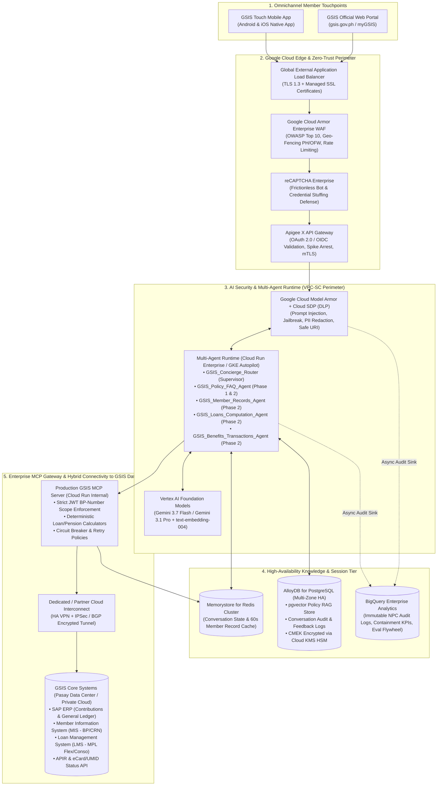
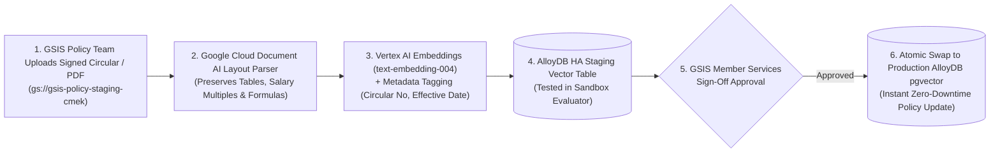
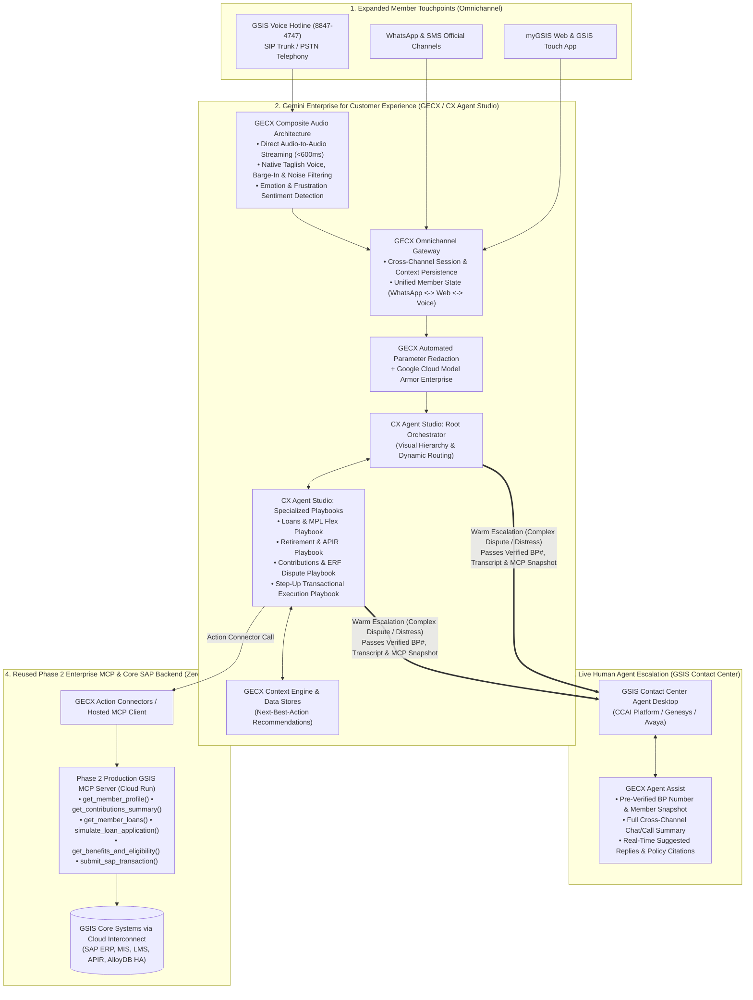

# TECHNICAL DESIGN DOCUMENT (TDD #2): ENTERPRISE PRODUCTION ROLL-OUT
## Government Service Insurance System (GSIS) — Omnichannel Multi-Agent AI Assistant ("GSIS Gabay AI")
### Production Architecture for 3.2M+ Members & Pensioners: Phases 1–2 on GEAP / Vertex AI + ADK & Phase 3 Expansion on Gemini Enterprise for CX (GECX / CX Agent Studio)

| Metadata Attribute | Details |
| :--- | :--- |
| **Document Reference** | `GSIS-TDD-PROD-2026-v1.3` |
| **Companion Documents** | • [01_BRD_GSIS_OMNICHANNEL_AI_CHATBOT.md](./01_BRD_GSIS_OMNICHANNEL_AI_CHATBOT.md) • [02_TDD_GSIS_CHATBOT_DEMO_MOCK_ARCHITECTURE.md](./02_TDD_GSIS_CHATBOT_DEMO_MOCK_ARCHITECTURE.md) |
| **Target Environment** | GSIS Production Landing Zone on Google Cloud (`asia-southeast1` Primary / `asia-east1` DR) |
| **Target Scale** | **2.6M+ Active Government Employees** + **600,000+ Pensioners** (`5,000+` concurrent peak sessions) |
| **Client Channels** | **Phases 1 & 2:** **GSIS Touch Mobile App** (Native Android & iOS) & **myGSIS Web Portal** **Phase 3 (GECX):** **Voice Hotline (`8847-4747` SIP)**, **WhatsApp**, **SMS**, & **Live Contact Center Agent Desktop (`Agent Assist`)** |
| **Core AI & CX Platforms** | **Phases 1 & 2:** Vertex AI (Gemini 3.7 Flash & 3.1 Pro), Google ADK, Model Context Protocol (MCP) **Phase 3:** **[Gemini Enterprise for Customer Experience — GECX / CX Agent Studio](https://cloud.google.com/gemini-enterprise-cx?e=48754805)** (Composite Audio, Omnichannel Gateway, Action Connectors) |
| **Enterprise Integrations** | GSIS Core **SAP ERP**, **Member Information System (MIS)**, **Loan Management System (LMS)**, **ERF Billing Engine**, **APIR Facial Verification API**, **GSIS Contact Center (`8847-4747` CCAI / SIP)** |
| **Security & Governance** | Cloud Armor Enterprise WAF, reCAPTCHA Enterprise, Apigee X, **Google Cloud Model Armor**, **GECX Automated Parameter Redaction**, Cloud DLP, Cloud KMS HSM (CMEK), VPC Service Controls |
| **Author / Lead Architect** | Mark Earvin Sarmiento (Google Cloud Architecture Team) |
| **Date** | September 23, 2026 |

---

## Table of Contents
1. [Executive Summary & Production Architectural Thesis](#1-executive-summary--production-architectural-thesis)
2. [Delta Matrix: Demo (TDD #1) vs. Production Phases 1–2 (GEAP/Vertex AI) vs. Phase 3 (GECX)](#2-delta-matrix-demo-tdd-1-vs-production-phases-12-geapvertex-ai-vs-phase-3-gecx)
3. [End-to-End Enterprise Production Topology (Phases 1 & 2 Foundation)](#3-end-to-end-enterprise-production-topology)
4. [Omnichannel Client Integration: Native GSIS Touch (Android/iOS) & Web Portal](#4-omnichannel-client-integration-native-gsis-touch-androidios--web-portal)
5. [Enterprise Authentication, OAuth 2.0 / OIDC & Step-Up MFA Architecture](#5-enterprise-authentication-oauth-20--oidc--step-up-mfa-architecture)
6. [Production RAG Architecture & Policy Corpus Governance Lifecycle](#6-production-rag-architecture--policy-corpus-governance-lifecycle)
7. [Production MCP Gateway & GSIS Core SAP / MIS / LMS Integration](#7-production-mcp-gateway--gsis-core-sap--mis--lms-integration)
8. [Defense-in-Depth Security: Model Armor Enterprise, VPC-SC & RA 10173 Compliance](#8-defense-in-depth-security-model-armor-enterprise-vpc-sc--ra-10173-compliance)
9. [High Availability, Capacity Sizing, FinOps & Observability (OpenTelemetry)](#9-high-availability-capacity-sizing-finops--observability-opentelemetry)
10. [Phased Production Roll-Out & Cutover Runbook (Phases 1, 2 & 3)](#10-phased-production-roll-out--cutover-runbook-phases-1-2--3)
11. [Phase 3 Architecture: Transitioning & Expanding to Gemini Enterprise for CX (GECX / CX Agent Studio)](#11-phase-3-architecture-transitioning--expanding-to-gemini-enterprise-for-cx-gecx--cx-agent-studio)

---

## 1. Executive Summary & Production Architectural Thesis

While **TDD #1** establishes a self-contained Cloud Run demonstration environment powered by synthetic member records in AlloyDB/SQLite, **TDD #2** defines the target **Enterprise Production Architecture** for rolling out **GSIS Gabay AI** across over **3.2 million Filipino civil servants and pensioners**.

### 1.1 Zero-Refactor Path from Demo (TDD #1) to Production (TDD #2)
Because the Multi-Agent system in TDD #1 is built on open **Model Context Protocol (MCP)** contracts and **Google Agent Development Kit (ADK)**:
* **The Multi-Agent Brain Remains Identical:** `GSIS_Concierge_Router`, `GSIS_Policy_FAQ_Agent`, `GSIS_Member_Records_Agent`, `GSIS_Loans_Computation_Agent`, and `GSIS_Benefits_Transactions_Agent` require **zero prompt or orchestration rewrites** when moving from Demo to Production Phase 1 & Phase 2.
* **Contract-Compatible Backend Swap:** Only the backing data providers behind the MCP Server and Auth Gateway change—swapping the **Synthetic Data Seeder & Mock Tables** for **GSIS Core SAP ERP / MIS / LMS APIs** via **Apigee X** and **Dedicated/Partner Cloud Interconnect**.

### 1.2 Strategic Architectural Choice: Why GEAP / Vertex AI for Phases 1–2 and GECX for Phase 3
A core architectural principle of the GSIS rollout is matching the right Google Cloud GenAI tier to the urgency and operational complexity of each phase:
1. **Phases 1 & 2 on GEAP / Vertex AI + Google ADK (`Weeks 1–10`):**
   * **Simplicity & Urgency:** GSIS requires immediate deployment of the unauthenticated FAQ assistant (Phase 1) and authenticated personal ledger/loan simulation assistant (Phase 2) inside `gsis.gov.ph` and `GSIS Touch` without being blocked by telephony SIP trunking, PBX routing, or contact center workforce retraining.
   * **Lightweight Code-First Velocity:** Deploying the Supervisor/Router (`GSIS_Concierge_Router`) and 4 Specialist Sub-Agents on Cloud Run + Vertex AI (`gemini-3.7-flash` & `gemini-3.1-pro`) with MCP tools delivers production self-service in weeks.
2. **Phase 3 on Gemini Enterprise for Customer Experience (`GECX / CX Agent Studio` — `Weeks 11–18`):**
   * **When Members Need Human Escalation & Voice:** Once self-service containment is live, Phase 3 addresses the remaining complex 30–35% of interactions where members need to **talk or chat with a real human GSIS officer** (e.g., multi-agency unposted ERF billing disputes, contested survivorship claims, distressed calamity loan inquiries, or senior pensioners calling `8847-4747`).
   * **Seamless Evolution into [GECX (`cloud.google.com/gemini-enterprise-cx`)](https://cloud.google.com/gemini-enterprise-cx?e=48754805):** Because our Phase 1–2 system already uses the **Supervisor/Router + Specialist Sub-Agent + MCP Tool** architecture, it maps 1-to-1 into **GECX CX Agent Studio**—turning `GSIS_Concierge_Router` into the **GECX Root Orchestrator**, the 4 Sub-Agents into **Specialized Playbooks**, and the 8 MCP tools into **GECX Action Connectors** without rewriting a single line of backend SAP/MCP code.

---

## 2. Delta Matrix: Demo (TDD #1) vs. Production Phases 1–2 (GEAP/Vertex AI) vs. Phase 3 (GECX)

| Architectural Layer | TDD #1: Executive Demo *(Mock Environment)* | Production Phases 1 & 2 *(GEAP / Vertex AI + ADK)* | Production Phase 3 *(Gemini Enterprise for CX — GECX)* |
| :--- | :--- | :--- | :--- |
| **Client Channels** | Omnichannel Dual-View Web App (`GSIS Touch Mobile Simulator` + `Web Portal View`). | Native **GSIS Touch Android/iOS SDK** (WebView/SSE) + **myGSIS Web Portal** widget. | **GECX Omnichannel Gateway:** Web, GSIS Touch, **WhatsApp, SMS, & Voice Telephony (`8847-4747` SIP)** with cross-channel context continuity. |
| **Voice & Audio Architecture** | Browser Web Speech API (Client-side STT/TTS). | Text/Rich-UI primary on Web & Mobile. | **GECX Composite Audio Architecture (Audio-to-Audio):** Native ultra-low-latency streaming (`<600ms`), natural **Taglish** accents, barge-in handling, and noise filtering. |
| **Multi-Agent Orchestration** | Google ADK (`GSIS_Concierge_Router` + 4 Sub-Agents) on single Cloud Run service. | Google ADK on **Multi-Zone Cloud Run Enterprise / GKE Autopilot** (`min-instances=5`, `max-instances=250`). | **GECX CX Agent Studio:** Visual **Root Orchestrator** + **Specialized Playbooks** wrapping/migrating ADK agents. |
| **AI Security & PII Redaction** | **Google Cloud Model Armor** (`sanitizeUserPrompt` / `sanitizeModelResponse`) + UI Trace Badge. | **Google Cloud Model Armor Enterprise** + **Cloud SDP (DLP)** + **VPC Service Controls**. | **Model Armor Enterprise** + **GECX Automated Parameter Redaction** (masks BP#, payouts, and PII in voice recordings & transcripts) + **VPC-SC**. |
| **Phase 1 Policy RAG & Grounding** | Embedded 18-doc GSIS policy corpus + AlloyDB `pgvector`. | **AlloyDB HA `pgvector`** + **Vertex AI Search** with HITL publishing workflow. | **GECX Native Context Engine & Data Stores** + Google Search grounding + **Next-Best-Action** recommendation engine. |
| **Phase 2 Personal Data MCP** | **Mock MCP Server** querying synthetic member records in SQLite/AlloyDB. | **Production Enterprise MCP Gateway** querying **GSIS Core SAP / MIS / LMS** over Cloud Interconnect. | **100% Reused via GECX Action Connectors:** Existing Phase 2 MCP functions (`get_member_profile()`, `simulate_loan_application()`) plug directly into GECX. |
| **Human Agent Escalation & Actions** | Displays **"Coming Soon! (Phase 3)"** modal for transactions and `8847-4747` hand-off. | Read-only + tentative simulation with signed deep-links into GSIS Touch screens. | **Live Warm Escalation to Human GSIS Agents (`Agent Assist`):** Transfers chat/voice call with verified `bp_number`, AI summary, MCP ledger snapshot, plus live SAP write execution. |

---

## 3. End-to-End Enterprise Production Topology

---

## 4. Omnichannel Client Integration: Native GSIS Touch (Android/iOS) & Web Portal

### 4.1 Native Mobile Integration Pattern (`GSIS Touch` Android & iOS)
To avoid maintaining duplicate conversational UI codebases across Android (Kotlin), iOS (Swift), and Web (React/HTML5), **GSIS Gabay AI** supports a dual integration pattern for the **GSIS Touch** mobile team:

1. **Pattern A — Authenticated Secure WebView Bridge (Fastest Rollout — 2 Weeks):**
   * The native GSIS Touch app embeds the Cloud Run Mobile-Optimized Chat UI inside a hardened `WKWebView` (iOS) / `AndroidWebView` (Android).
   * When the member is already logged into GSIS Touch (via password or biometrics), the native app passes the short-lived **OAuth 2.0 Bearer Token** to the WebView via an encrypted `postMessage` bridge (`window.GSISTouchBridge.injectSessionToken(jwt)`), automatically activating **Phase 2** without asking the user to log in a second time.
2. **Pattern B — Native UI over Server-Sent Events (`SSE` Streaming REST API):**
   * Native mobile screens invoke `POST https://api.gsis.gov.ph/gabay-ai/v1/chat/stream` directly with `Authorization: Bearer <gsis_touch_jwt>`, rendering streaming markdown tokens, structured summary cards, and deep-link buttons (`gsistouch://loans/mpl-flex/apply`) in native mobile components.

---

## 5. Enterprise Authentication, OAuth 2.0 / OIDC & Step-Up MFA Architecture

In production, authentication bridges two entry points:

| Entry Scenario | Authentication & Token Flow | Session & Scope Binding |
| :--- | :--- | :--- |
| **Scenario 1: User opens Chat from inside `GSIS Touch` Mobile App (Already Logged In)** | Native app exchanges the active GSIS Touch refresh/access token at **Apigee X** for a chat-scoped **OIDC JWT** (`aud: gsis-gabay-ai`, `ttl: 900s`) containing the member's verified `bp_number` and `crn`. | Zero secondary login prompt; immediately enters **Phase 2**. |
| **Scenario 2: User starts in Phase 1 (Public Web Portal or Pre-Login Mobile Screen) and asks a Personal Query** | Chatbot prompts user to sign in. User enters **GSIS Username & Password** $\rightarrow$ GSIS Identity Provider dispatches a real **6-Digit SMS/Email OTP** to their registered mobile/email $\rightarrow$ Upon OTP verification, Apigee issues the `bp_number`-bound JWT. | Transitions session seamlessly from **Phase 1** to **Phase 2** while preserving conversation history. |

---

## 6. Production RAG Architecture & Policy Corpus Governance Lifecycle

Because GSIS loan policies, dividend rates, emergency loan declarations (calamity areas), and retirement circulars are updated periodically by the **GSIS Board of Trustees**, the Phase 1/Phase 2 RAG pipeline enforces a governed **Human-in-the-Loop (HITL) Publishing Pipeline**:

* **Strict Version & Expiry Filtering:** Every vector chunk in AlloyDB carries `effective_start_date`, `effective_end_date`, and `superseded_by_circular`. The `search_gsis_faq_rag` query appends `WHERE status = 'PUBLISHED' AND CURRENT_DATE BETWEEN effective_start_date AND COALESCE(effective_end_date, '9999-12-31')` so obsolete loan policies are never retrieved.

---

## 7. Production MCP Gateway & GSIS Core SAP / MIS / LMS Integration

In Production Phase 2, the **Enterprise MCP Server** replaces the synthetic AlloyDB tables with read-only adapters to GSIS Core Systems over **Cloud Interconnect**:

| MCP Tool Name | Target GSIS Core System (Production) | Protocol / Adapter | Caching & Resiliency Strategy |
| :--- | :--- | :--- | :--- |
| `get_member_profile` | **GSIS Member Information System (MIS)** | REST / SOAP over Apigee Private Endpoint | Cached in **Memorystore Redis** (encrypted) for `300s` per `bp_number`. |
| `get_contributions_summary` | **SAP ERP Financials / ERF Remittance Ledger** | SAP OData / RFC via Apigee SAP Integration Connector | Cached for `180s`; circuit breaker returns cached snapshot if SAP is undergoing nightly batch posting. |
| `get_member_loans` | **GSIS Loan Management System (LMS)** | REST API (`/lms/v2/members/{bp_number}/loans`) | Real-time fetch (`60s` cache); timeout set to `2,500ms`. |
| `simulate_loan_application` | **LMS Tentative Computation Engine** + **MCP Deterministic Calculator** | Hybrid: Fetches live balances from LMS + executes verified Python/LMS computation rule. | Appends mandatory **RA 8291 / LMS Tentative Computation Disclaimer**. |
| `get_benefits_and_eligibility` | **GSIS Claims & Actuarial System** + **APIR Verification Database** | REST API (`/claims/v2/projections/{bp_number}`) | Computes BMP, Option 1/Option 2 lump sums, CSV, and APIR Birth-Month status. |
| `get_recent_transactions` | **SAP General Ledger & eCard Disbursement Gateway** | SAP OData (`/sap/opu/odata/gsis/MEMBER_TX_SRV`) | Returns top 10 posted remittances, loan deductions, and eCard disbursements. |

---

## 8. Defense-in-Depth Security: Model Armor Enterprise, VPC-SC & RA 10173 Compliance

To satisfy the **National Privacy Commission (NPC)** under **Republic Act No. 10173 (Data Privacy Act of 2012)** and **BSP / Government Information Security Standards**:

1. **Google Cloud Model Armor Enterprise (`Organization & Folder Policy`):**
   * Mandatory inline inspection (`sanitizeUserPrompt` and `sanitizeModelResponse`) on 100% of Phase 1 and Phase 2 turns.
   * **Prompt Injection & Jailbreak Protection:** Configured at `HIGH` sensitivity to block instruction overrides, system prompt extraction, and SQL/tool manipulation.
   * **Cloud Sensitive Data Protection (SDP / DLP):** Redacts any unmasked TIN, PhilSys National ID, bank account numbers, or cross-member BP numbers before logging or egress.
2. **Cryptographic Session Isolation (Anti-IDOR / Anti-Cross-Account Leakage):**
   * The `bp_number` parameter is **never** exposed in the LLM function schema. The Production MCP Server extracts `bp_number` exclusively from an mTLS-authenticated header signed by **Apigee X (`X-Apigee-Verified-BP-Number`)**.
3. **VPC Service Controls (VPC-SC) & Customer-Managed Encryption Keys (CMEK):**
   * Vertex AI, Cloud Run, AlloyDB HA, Memorystore, and BigQuery operate inside a unified **VPC Service Controls Perimeter**, preventing data exfiltration to unauthorized GCP projects or public internet endpoints.
   * All database volumes, backups, and BigQuery audit tables are encrypted using **Cloud KMS Hardware Security Modules (HSM — FIPS 140-2 Level 3)** with keys managed by the GSIS Information Security Office.
4. **Zero Model Training on GSIS Member Data:**
   * Under Google Cloud Vertex AI Data Governance guarantees, **zero GSIS member prompts, MCP payloads, or conversation logs** are ever used to train foundation models.

---

## 9. High Availability, Capacity Sizing, FinOps & Observability (OpenTelemetry)

### 9.1 Production Capacity Sizing (3.2M Members / Payday & Calamity Loan Surges)
* **Cloud Run Enterprise / GKE Autopilot:**
  * Configured with `min-instances: 5` (zero cold starts) and `max-instances: 250` (`80 concurrent requests per instance`), supporting up to **20,000 concurrent streaming connections** during peak payday or Emergency Loan openings.
* **AlloyDB for PostgreSQL High Availability:**
  * Primary instance (`8 vCPU, 64 GB RAM`) across 2 availability zones in `asia-southeast1` + Read Pool (`2 x 4 vCPU`) for high-throughput `pgvector` FAQ RAG similarity searches.
* **Vertex AI Provisioned Throughput / Dynamic Shared Quota (DSQ):**
  * Uses **Gemini 3.7 Flash** for ultra-low-latency (`<1.2s` TTFT) routing and sub-agent tool synthesis, paired with **Gemini 3.1 Pro** for complex multi-loan/retirement reasoning, with **Provisioned Throughput** reserved during peak announcement windows.

### 9.2 OpenTelemetry (OTel) & Cloud Monitoring Alerting
* Tracks four golden agent telemetry signals exported to **Google Cloud Monitoring**:
  1. **TTFT & End-to-End Turn Latency (`P50`, `P95`, `P99`)**
  2. **MCP Core System Tool Error Rate & Circuit-Breaker Trips**
  3. **Model Armor Block Rate (`piAndJailbreakFilter` & `sdpRedaction` counts)**
  4. **Task Containment Rate vs. Contact Center (8847-4747) Escalation Rate**

---

## 10. Phased Production Roll-Out & Cutover Runbook (Phases 1, 2 & 3)

| Rollout Stage | Target Timeline | Scope & Milestones | Exit / Go-Live Gate |
| :--- | :--- | :--- | :--- |
| **Stage 0: Executive Demo & Sandbox Validation** *(TDD #1)* | **Sprint 0 (Completed)** | Deploy Cloud Run Omnichannel Demo + Age-Aware Synthetic Data Seeder + Mock MCP + Model Armor (`28/28` Golden Evals Passed). | Executive sign-off by GSIS OPGM, ITSG, and Member Services. |
| **Stage 1: Phase 1 Production Roll-Out (Public FAQ RAG on `GEAP / Vertex AI`)** | **Weeks 1–4** | Ingest official GSIS Citizen's Charter & Circulars into AlloyDB HA `pgvector`; configure Cloud Armor WAF & Model Armor; embed Phase 1 widget on `gsis.gov.ph` and GSIS Touch pre-login screen. | $\ge 95\%$ RAG evaluation score on 300 Golden GSIS FAQ test cases; CISO security sign-off. |
| **Stage 2: Phase 2 Production Roll-Out (Authenticated Personal Queries on `GEAP / Vertex AI + ADK + MCP`)** | **Weeks 5–10** | Connect Production MCP Server to SAP/MIS/LMS over Cloud Interconnect + Apigee X; integrate GSIS Touch OAuth 2.0 / OTP MFA; enable live contributions, loans, benefits & transaction queries. | Zero cross-account leakage in penetration testing; $100\%$ numerical parity with GSIS Touch member screens. |
| **Stage 3A: Phase 3 GECX Omnichannel Wrapper & Human Escalation (`GECX / CX Agent Studio`)** | **Weeks 11–14** | Plug existing Phase 2 MCP Server & ADK endpoints into **[Gemini Enterprise for CX (GECX)](https://cloud.google.com/gemini-enterprise-cx?e=48754805)** via **Action Connectors**; activate **Composite Audio-to-Audio Taglish Voice (`8847-4747`)**, **WhatsApp/SMS**, and **Warm Human Agent Escalation (`Agent Assist`)**. | $<600\text{ms}$ voice turn latency; $100\%$ session & `bp_number` transfer accuracy to live GSIS Contact Center desktops. |
| **Stage 3B: Phase 3 Visual Playbook Migration & SAP Transactional Execution (`GECX`)** | **Weeks 15–18** | Migrate routing logic into CX Agent Studio visual Playbooks and activate step-up authenticated SAP write flows (1-tap MPL Flex application submission, APIR video booking, and ERF reconciliation ticketing). | Full transactional audit sign-off, GECX Automated Parameter Redaction verification, and biometric step-up confirmation. |

---

## 11. Phase 3 Architecture: Transitioning & Expanding to Gemini Enterprise for CX (`GECX / CX Agent Studio`)

While **Phases 1 and 2** are intentionally architected using **GEAP / Vertex AI + Google ADK** to deliver immediate, low-complexity web and mobile self-service, **Phase 3** transitions and expands the ecosystem into **[Gemini Enterprise for Customer Experience (GECX)](https://cloud.google.com/gemini-enterprise-cx?e=48754805)**—specifically **CX Agent Studio**—when GSIS integrates **live human contact center officers**, **voice telephony (`8847-4747`)**, **WhatsApp/SMS**, and **complex dispute resolution**.

### 11.1 Architectural Mapping: From GEAP/ADK System to GECX (`CX Agent Studio`)

Because our Phase 1–2 architecture already implements a **Supervisor/Router pattern** delegating to **Specialist Sub-Agents** and **MCP Tools**, every component maps cleanly into GECX without discarding or rewriting existing backend code:

| Phase 1–2 Component (`GEAP / Vertex AI + ADK`) | Phase 3 Equivalent in `GECX (CX Agent Studio)` | Migration & Integration Mechanism |
| :--- | :--- | :--- |
| **`GSIS_Concierge_Router` (Supervisor)** | **GECX Root Orchestrator / Agent** | Instead of manual code routing, CX Agent Studio manages the sub-agent hierarchy visually, handling multi-turn intent shifts, sentiment distress detection, and human escalation rules dynamically. |
| **4 Specialist Sub-Agents** (`FAQ`, `Member_Records`, `Loans_Computation`, `Benefits_Transactions`) | **Specialized Playbooks / Sub-Agents** in CX Agent Studio | Each specialist domain becomes a dedicated **CX Agent Studio Playbook** (e.g., *Loans & MPL Flex Reloan Playbook*, *RA 8291 Retirement & APIR Playbook*, *Unposted ERF Dispute Playbook*). |
| **8 MCP Server Tools & Python Calculators** (`get_member_profile()`, `simulate_loan_application()`, etc.) | **GECX Action Connectors / Hosted MCP Hooks** | Existing Cloud Run MCP endpoints and deterministic Python calculators plug directly into CX Agent Studio via **OpenAPI / MCP Action Connectors**—**0% backend code rewrite required**. |
| **Static RAG (`search_gsis_faq_rag`)** | **GECX Native Context Engine & Data Stores** | Connects existing AlloyDB `pgvector` / Vertex AI Search corpora directly into GECX Data Stores, adding Google Search grounding and proactive **Next-Best-Action** recommendations. |

---

### 11.2 End-to-End Phase 3 GECX Omnichannel, Voice & Human Escalation Topology

---

### 11.3 How GECX Addresses GSIS Phase 3 Expansion Requirements

1. **🗣️ Voice & Ultra-Low Latency (`Composite Audio Architecture`):**
   * Traditional voice bots rely on a sequential chain (`Speech-to-Text ➡️ LLM ➡️ Text-to-Speech`), introducing `2.5s–4.0s` of transcription lag that feels unnatural on telephone hotlines.
   * **GECX Advantage:** CX Agent Studio introduces a **Composite Audio Architecture (Audio-to-Audio)** that streams audio directly to and from the multimodal Gemini model. This achieves ultra-low latency (`<600ms`), detects caller emotion/distress (e.g., an elderly pensioner worried about a suspended pension or a calamity victim), handles mid-sentence **barge-ins (interruptions)** gracefully, and filters out background noise.
2. **💬 Multilingual & Fluid Code-Switching (`Taglish`):**
   * Filipino civil servants and pensioners naturally blend Tagalog and English (*"Ma'am/Sir, nag-apply po ako ng MPL Flex sa WhatsApp kanina, pwede po bang i-follow up yung net proceeds ko?"*).
   * **GECX Advantage:** GECX pairs Gemini's native code-switching fluency with natural, regionally accented audio voices so the **Taglish** voice experience on `8847-4747` sounds warm and human rather than robotic.
3. **📱 Multi-Channel Continuity (`GECX Omnichannel Gateway`):**
   * **GECX Advantage:** GSIS builds the Playbook logic once in CX Agent Studio and publishes it simultaneously across **Web (`gsis.gov.ph`), GSIS Touch Mobile App, WhatsApp, SMS, and Voice Telephony (`8847-4747` SIP)**.
   * **Cross-Channel Context Persistence:** Conversational state travels with the authenticated `bp_number` / verified mobile number. If a teacher starts an MPL Flex loan simulation on WhatsApp during lunch break and calls the `8847-4747` hotline in the afternoon, the GECX voice agent greets them with full awareness: *"Welcome back, Teacher Maria! I see we were looking at your ₱286,000 MPL Flex simulation on WhatsApp earlier today—would you like to proceed with that or speak with a Loans Officer?"*
4. **🤝 Seamless Warm Escalation to Live Human Agents (`GECX Agent Assist`):**
   * When a conversation requires human empathy or administrative authority (e.g., reconciling an unposted agency ERF deduction with an Agency Authorized Officer [AAO], filing a survivorship appeal, or resolving an identity lock), GECX executes a **Warm Hand-Off** to a live GSIS Contact Center Agent.
   * **Zero Repetition for the Member:** The human agent immediately sees the member's verified `bp_number`, the MCP tool outputs already fetched (`get_contributions_summary`, `get_member_loans`), a concise AI-generated summary of the conversation so far, and real-time **GECX Agent Assist** knowledge suggestions.
5. **🛡️ Enterprise Security, Automated Parameter Redaction & Compliance:**
   * Because GSIS handles highly sensitive pension, salary, and loan records under **Republic Act No. 10173 (Data Privacy Act of 2012)**, GECX adds **Automated Parameter Redaction** (automatically scrubbing BP numbers, CRNs, bank accounts, and pension figures from plain-text logs and call transcripts) alongside **Google Cloud Model Armor** and **VPC Service Controls (VPC-SC)**.

---

### 11.4 Two-Stage Zero-Disruption Migration Runbook (`ADK` $\rightarrow$ `GECX`)

To ensure zero disruption to the live Phase 1 and Phase 2 services on `gsis.gov.ph` and `GSIS Touch`, the transition to GECX executes in two incremental stages:

1. **Stage 3A — GECX as the Omnichannel & Voice Wrapper (`Weeks 11–14`):**
   * Keep the existing Phase 2 Cloud Run Multi-Agent & MCP backend running unchanged.
   * Connect GECX CX Agent Studio to the Phase 2 MCP Server and ADK API via **GECX Action Connectors**.
   * Immediately launch **Voice (`8847-4747` Composite Audio)**, **WhatsApp/SMS**, and **Live Human Agent Escalation (`Agent Assist`)** using GECX as the omnichannel front door.
2. **Stage 3B — Native Playbook Consolidation in CX Agent Studio (`Weeks 15–18`):**
   * Gradually migrate the routing logic from `GSIS_Concierge_Router` into CX Agent Studio's visual low-code Playbook hierarchy so GSIS business analysts and contact center supervisors can tune escalation thresholds, voice prompts, and Next-Best-Action rules visually while continuing to invoke the exact same deterministic Python/SAP MCP tools underneath.

